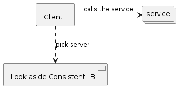

# Consistent Hash load balancer

This project is a sample proof of concept on using consistent hash as a load balancer.

## Excellent articles / videos about consistent hashing

* [A Guide to Consistent Hashing](https://www.toptal.com/big-data/consistent-hashing#:~:text=according%20to%20Wikipedia\).-,Consistent%20Hashing%20is%20a%20distributed%20hashing%20scheme%20that%20operates%20independently,without%20affecting%20the%20overall%20system.)
  
* [A Brief Introduction to Consistent Hash - YouTube](https://www.youtube.com/watch?v=tHEyzVbl4bg)

This project is a simple implementation of a look aside load balancer using consistent hash.


## The use case

Our use case is to be able to route a key to a particular node in order to make use of the local cache held in that node.
The process that needs to be performed by this node for this particular key must be in order.  

As an example: __Calculating an account balance__

Using Consistent hash, we can direct the request from an __account number__ to a specific node.  

## Usage

First update the list of cluster members, an example is [here](hack/config.yaml)

``` yaml
infrastructure:
    nodes:
    - name: localhost:10001
    - name: localhost:10002
    - name: localhost:10003
    - name: localhost:10004
    - name: localhost:10005
    - name: localhost:10006
    - name: localhost:10007
    - name: localhost:10008
    - name: localhost:10009
    - name: localhost:10010
```

When you boostrap the consistent hash, it will automatically populate the hash ring with these members.

### Run the lb

``` console
./consistent-demo balancer --config ./hack/config.yaml
```

Pick the member

``` console
curl http://localhost:3000/pick/12345
```
This will return a json

``` json
{"previousNode":"","currentNode":"localhost:10003"}
```

The `previousNode` is to help the participating service to determine if the request was previously handled by it.
This can be very useful to tell the service that please refresh you local cache, since the previous request was not sent to you.

The client code can now use the `currentNode` to send its request to.

### Adding a node

Say you want to add a node `localhost:9999` as a member.

``` console
curl --location --request POST 'http://localhost:3000/node/' --form 'node="localhost:9999"'
```

### Removing a node
Say you want to remove the node `localhost:9999` from membership.  Example, the node was taken down for service.

``` console
curl --location --request DELETE 'http://localhost:3000/node/' --form 'node="localhost:9999"'
```

### Why look aside

The look aside load balancer frees the load balancer from proxying the request to the intended service.  This can be kept really light and should be able to serve plenty of requests.


